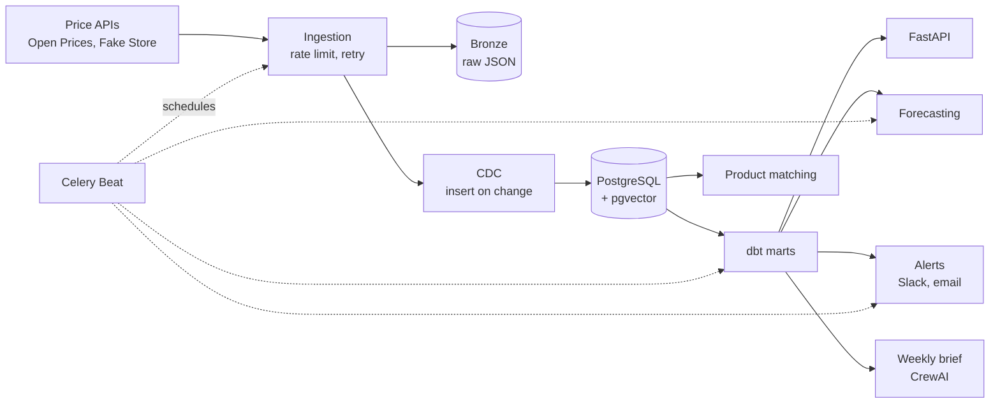

# Competitor Price & Availability Intelligence Platform

[](https://github.com/Lovevyas21/Competitor_Price_-_Availability_Intelligence_Platform_CompAI/actions/workflows/ci.yml)


A data platform that tracks competitor prices and stock across retailers, works out
who is undercutting you, forecasts where prices are heading, and sends a weekly
pricing brief.

**Live demo:** https://api-production-46f4.up.railway.app/showcase

## Features

- **Multi-source ingestion** from public product price APIs, with rate limiting,
  retries and a dead-letter queue.
- **Raw-first storage.** Every API response is saved to a bronze layer (local disk or
  S3) before parsing, so the warehouse can be rebuilt without calling any API again.
- **Change data capture.** A price is stored only when it changes, with idempotency keys
  so replays never write duplicates.
- **dbt models** going from staging to intermediate to marts, with data quality tests on
  every build.
- **Undercut alerts** to Slack or email, with deduplication and a cooldown.
- **Per-SKU forecasting** with statsforecast (AutoETS / AutoARIMA against a
  seasonal-naive baseline), picked per series on backtested error.
- **Product matching** with vector embeddings in pgvector, plus a Streamlit screen for
  reviewing borderline matches.
- **Weekly pricing brief** written by Google Gemini (via CrewAI). It's checked so that every number
  in it must exist in the warehouse data.
- **REST API** with FastAPI, plus an interactive walkthrough of the pipeline at
  `/showcase`.

## Architecture



Celery workers run ingestion and the downstream jobs on a schedule, with Redis as the
broker. Postgres holds the event history and the marts. The API, the alerting service
and the brief all read from the same dbt marts, so they always agree on the numbers.

## Tech stack

| Area | Tools |
|---|---|
| Language | Python 3.12 |
| Storage | PostgreSQL 16, pgvector, S3-compatible object storage |
| Orchestration | Celery, Celery Beat, Redis |
| Transformation | dbt (dbt-postgres), Polars, Pandera |
| Data access | SQLAlchemy 2.0, Alembic, Pydantic v2 |
| Forecasting | statsforecast |
| AI | CrewAI, Gemini (via LiteLLM), fastembed |
| API / UI | FastAPI, Uvicorn, Streamlit |
| Infrastructure | Docker, Railway, Terraform (AWS), GitHub Actions |

## Project structure

```
app/
  ai/           facts, LLM brief, numeric guard, product matching, chat
  alerting/     undercut alert service and delivery channels
  api/          FastAPI app and dependencies
  clients/      one client per data source behind a common interface
  core/         settings, logging, database session
  forecasting/  dataset building, training, backtesting
  ingestion/    runner, bronze store, CDC, rate limiting, Celery tasks
  models/       domain models and validation
  showcase/     pipeline walkthrough UI
  ui/           Streamlit match review
dbt/            staging, intermediate and mart models
migrations/     Alembic migrations
infra/          Terraform (persistent and ephemeral AWS stacks)
scripts/        deployment and report scripts
tests/          unit, contract and integration tests
docs/           architecture decision records and project report
```

## Getting started

### Prerequisites

- Python 3.12
- Docker and Docker Compose
- [uv](https://github.com/astral-sh/uv) (recommended) or pip

### Installation

```bash
git clone https://github.com/Lovevyas21/Competitor_Price_-_Availability_Intelligence_Platform_CompAI.git
cd Competitor_Price_-_Availability_Intelligence_Platform_CompAI

uv venv
uv pip install -e ".[dev,matching,ai,transform]"

cp .env.example .env
docker compose up -d db redis
alembic upgrade head
```

### Configuration

Settings are read from environment variables or `.env`. The defaults work with the
local Docker setup. The variables you're most likely to change:

| Variable | Purpose |
|---|---|
| `DATABASE_URL_OVERRIDE` | Full Postgres URL for a hosted database |
| `REDIS_URL` | Celery broker and cache |
| `BRONZE_BACKEND` | `local` or `s3` |
| `BRONZE_S3_BUCKET` / `BRONZE_S3_ENDPOINT_URL` | Object storage for raw payloads |
| `LLM_MODEL` / `GEMINI_API_KEY` | Enables the LLM brief, e.g. `gemini/gemini-3.5-flash` |
| `API_KEY` | Turns on `X-API-Key` authentication for the API |
| `SLACK_WEBHOOK_URL` | Alert delivery to Slack |
| `SHOWCASE_ENABLED` | Serves `/showcase` outside dev |

The full list is in [`app/core/settings.py`](app/core/settings.py).

## Usage

### Ingest data

```bash
python -m app.cli sources                         # list configured sources
python -m app.cli seed openprices --limit 25      # pick the best-tracked SKUs
python -m app.cli ingest openprices --seeds       # full history for seeded SKUs
python -m app.cli ingest openprices --limit 300   # recent prices across many SKUs
python -m app.cli status                          # warehouse summary
python -m app.cli replay openprices 2026-08-29    # rebuild a day from bronze
```

### Run the pipeline

```bash
make worker      # Celery worker
make beat        # Celery scheduler
make dbt-build   # build and test the dbt models
make api         # API at http://localhost:8000/docs
```

Other targets: `make forecast`, `make alerts`, `make match`, `make review`,
`make brief`, `make showcase`, `make flower`. Run `make test` for the test suite.

### API

| Method | Endpoint | Description |
|---|---|---|
| GET | `/health` | Service and database status |
| GET | `/products` | Tracked products |
| GET | `/prices/{product_id}` | Price history for a product |
| GET | `/forecasts/{product_id}` | Forecast for a product |
| GET | `/undercuts` | Current competitor undercuts |
| GET | `/alerts` | Alerts that have been sent |
| GET | `/matches/review` | Product matches waiting for review |

Interactive docs are at `/docs`. When `API_KEY` is set, every endpoint except `/health`
needs an `X-API-Key` header.

### Scheduled jobs

All times are UTC and come from [`app/celery_app.py`](app/celery_app.py).

| Schedule | Job |
|---|---|
| Every 6 hours | Refresh tier 1 SKUs, evaluate alerts |
| Daily 01:15 | Broad price discovery |
| Daily 01:45 | Rebuild dbt marts |
| Daily 02:15 | Refresh product matches |
| Daily 02:30 | Refresh tier 2 SKUs |
| Daily 03:00 | Train forecasts |
| Sunday 04:00 | Refresh tier 3 SKUs |
| Monday 06:00 | Generate the weekly brief |
| 25th of each month | Create upcoming table partitions |

## Data model

- `price_events` and `stock_events` are append-only and partitioned by month on
  `observed_at`.
- `product_versions` is an SCD Type 2 dimension, with exactly one current row per
  product.
- Every event has an idempotency key, so re-running a load never duplicates history.
- Prices are compared only within the same currency. Currency is part of the grain of
  every mart.

| Mart | What it answers |
|---|---|
| `mart_undercut_alerts` | Who is undercutting us, by how much, and how fresh the evidence is |
| `mart_price_gap_vs_own` | How competitor prices compare with our catalogue |
| `mart_price_trend` | Daily price series and day-over-day change |
| `mart_price_volatility` | Which SKUs move the most |
| `mart_out_of_stock_frequency` | Out-of-stock rate per SKU and retailer |

## Analytics and AI

### Undercut detection

`mart_undercut_alerts` compares each competitor's latest price with our own price for
the same product and currency, and grades the gap:

| Gap vs our price | Severity |
|---|---|
| 20% or more below | critical |
| 10% to 20% below | high |
| Under 10% below | medium |

Every row also carries how old its evidence is (`fresh` within a day, `recent` within a
week, `stale` beyond that). The alerting service only pages for evidence up to 7 days
old, and it fingerprints each alert so a running undercut is sent once a day at most. A
deeper cut counts as a new alert.

### Price volatility

`mart_price_volatility` uses the coefficient of variation (standard deviation divided
by mean price) of each product's daily closing price. A product with a CV of 0.20 or
higher is flagged as highly volatile.

### Forecasting

Prices are forecast 7 days ahead for each product and retailer, using
[statsforecast](https://github.com/Nixtla/statsforecast):

- **Models:** AutoETS, AutoARIMA and a SeasonalNaive baseline, all with weekly
  seasonality.
- **Model selection:** each series is backtested with 3 rolling windows, and the model
  with the lowest MAPE wins that series. A model has to beat the baseline outright to
  replace it.
- **Data preparation:** series are filled onto a daily grid. Accuracy is scored only on
  days that were really observed, not on filled ones.
- **Eligibility:** a series needs at least 10 observations and a price seen within the
  last 30 days.
- **Output:** a point forecast with an 80% prediction interval, saved to `forecasts`,
  plus each model's backtest score in `forecast_accuracy`. Both are served at
  `/forecasts/{product_id}`.

### Product matching

The same product often appears under different names at different retailers. Matching
runs in three steps:

1. **Identifiers first.** Products with the same UPC are matched directly.
2. **Embeddings.** Product titles, brand and category are embedded with
   `all-MiniLM-L6-v2` (384 dimensions, run locally via fastembed) and stored in
   pgvector. Candidates come from a cosine-similarity search within the same category.
3. **Confidence bands.**

| Similarity | Decision |
|---|---|
| 0.92 or higher | Matched automatically |
| 0.80 to 0.92 | Sent to the review queue (Streamlit UI and `/matches/review`) |
| Below 0.80 | Rejected |

### AI pricing brief (Gemini)

Every Monday the platform writes a short pricing brief for the category team. It is
generated by **Google Gemini** (`gemini-3.5-flash`), called through CrewAI and LiteLLM.

1. `app/ai/facts.py` collects a fixed set of figures from the marts: totals, top
   undercuts, most volatile products, biggest movers, forecast summary, forecast
   accuracy and data quality.
2. Gemini receives only that payload as JSON. It never gets a database connection.
3. `app/ai/guard.py` pulls every number out of the generated text and checks that it
   exists in the payload. A brief with any number that can't be traced back is thrown
   away.
4. If the guard rejects the brief, or the model is unavailable, the platform publishes a
   template-rendered version of the same facts instead.

On the live deployment, the brief is written by Gemini and every figure passes the
check (for example, 17 of 17 verified). There's an example in
[`docs/sample-weekly-brief.md`](docs/sample-weekly-brief.md).

### Ask the data

The showcase page has a question box that uses the same Gemini model and the same
numeric guard. It answers only from the current facts payload. If an answer contains a
number the data doesn't support, it refuses rather than guessing.

### LLM cost controls

- One model call per brief, with Gemini's "thinking" mode turned off. On this job that
  cut token usage by about 85% with no loss in quality.
- If the facts haven't changed, the brief is served from a Redis cache for 24 hours.
- Request limits per minute and per day are shared across all workers through Redis.
- Transient provider errors (503, 429) are retried with backoff. Authentication errors
  fail straight away.

## Testing

```bash
docker compose up -d db redis
pytest
```

The suite has unit, contract and integration tests. The integration tests run against
a real Postgres and Redis. CI runs linting (ruff), the tests, `dbt build`, Terraform
validation and a Docker image build on every push.

## Deployment

The app runs on [Railway](https://railway.com) as three services built from the same
Dockerfile:

| Service | Command |
|---|---|
| `api` | `uvicorn app.api.main:app --host 0.0.0.0 --port $PORT` |
| `worker` | `celery -A app.celery_app worker -Q ingest,default,maintenance` |
| `beat` | `celery -A app.celery_app beat` |

These sit alongside Postgres with pgvector, Redis and an S3-compatible bucket for the
bronze layer. Each deploy runs `alembic upgrade head` and `dbt build` before the new
version goes live.

An AWS setup (VPC, RDS, EC2, S3, SSM, IAM) is also included as Terraform in
[`infra/`](infra/), with scripts to create and destroy it on demand. See
[`infra/README.md`](infra/README.md).

## Documentation

- [Architecture decision records](docs/adr/)
- [Sample weekly brief](docs/sample-weekly-brief.md)
